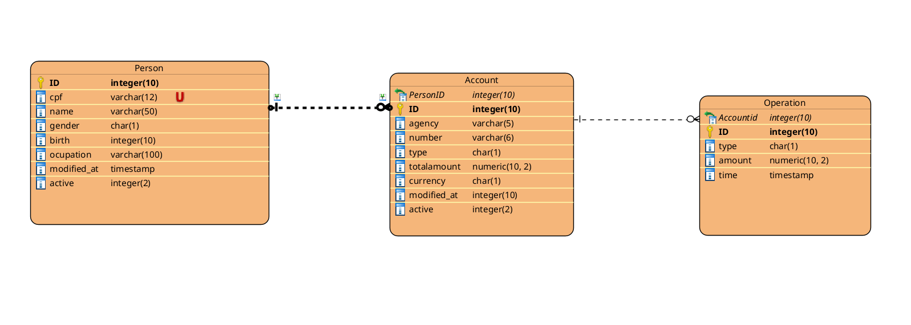

# Contas digitais
    Este projeto simula um sistema de contas digitais, com operações de saques e depósitos.

Banco de Dados Utilizado: PostgreSQL

Para inicializar o sistema, é necessário criar um arquivo .env na raiz do projeto e formatá-lo dessa maneira:

```
DB_URL = <URL DO BANCO> 
DB_USERNAME = <USUÁRIO>
DB_PASSWORD = <SENHA>
```


### ME-R: Diagrama Entidade-Relacionamento
